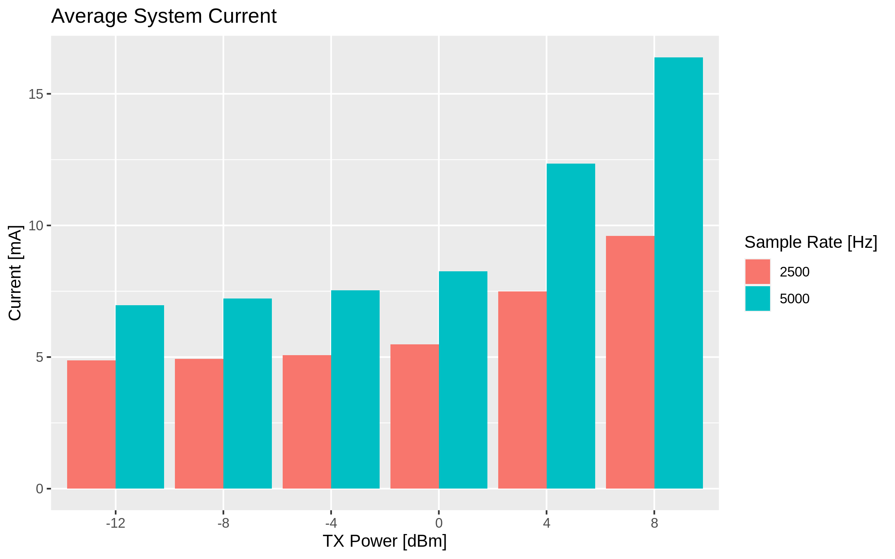

# Power Consumption

The power consumption of the system depends strongly on the data rate and the transmit power.

We measured the current for different combinations of sample rate and transmit power using the voltage drop over a 680mΩ resistor.
The voltage drop has been amplified by a factor of 100 with an INA180 current sense amplifier and then sampled with 1.5MHz with a logic analyser.
This makes it possible to see the current consumption during different activities.
It is possible to clearly see the current during radio transmit, radio receive and idle.

The traces have then been analysed for minimum, mean and peak current over 500ms windows.

We can clearly see that the average current increases significantly when raising the transmit power over 0dBm.
This results in increased range but that is probably not needed.
Below 0dBm the savings for decreasing transmit power are a lot less severe.

What can also be seen is that the sample rate has a big influence on overall power consumption.
A lower sample rate results in a lower data rate which reduces radio time spent transmitting data packets.
