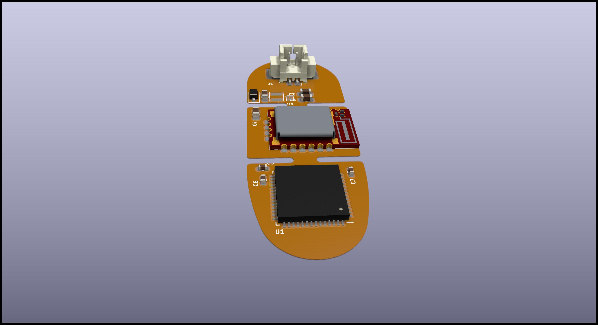
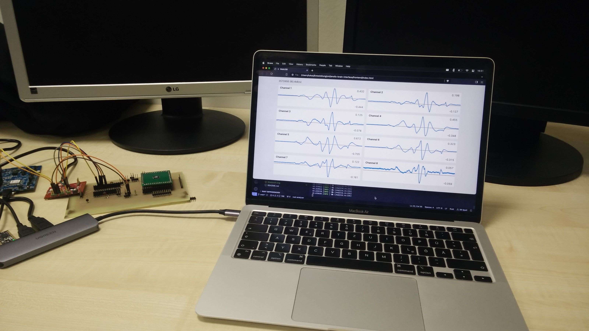

2023-11-09

# Anolis Brain Interface Report

## Concept

The Anolis Brain Interface consists of a flexible PCB to be mounted on the back of a lizard of the species *Anolis carolinensis*.
It measures brain activity of the animal and transmits the data in real time to a connected PC via Bluetooth.

## What has been done so far

### PCB

We have created a draft for a PCB for use with LiPo batteries.
It features a segmented design for increased flexibility.
It is still a bit big however.

*Segmented PCB Draft*

After better estimation of the power requirements we will most likely change the design to use coin cell batteries instead.

We might also get rid of the segments to reduce the size further.

The brain interface is equipped with an analogue frontend in form of the Intan RHD2216 electrophysiological amplifier.
It also features the Würth Electronic Setebos-I Bluetooth module.
It contains a Bluetooth antenna and circuitry as well as the Nordic Semiconductor nRF52840 SoC which consists of a Bluetooth radio module and an ARM Cortex-M4F processor with 64MHz, 1MB flash memory and 256kB RAM.

### Software

A prototype of the software is complete by now.
It consists of three different parts.

The main software runs on the brain interface PCB.
It measures the electrophysiological signals with the Intan RHD2216 chip via SPI.
Then the collected data is transmitted in real time via a Bluetooth connection to a USB dongle.

The USB dongle runs a firmware which scans for and connects to the brain interface.
After a successful connection has been established it receives the data and transfers it via USB to the PC.

On the PC runs a frontend software in a web browser that connects to the dongle using the WebUSB API.
It collects the data and displays it in real time in the browser window.
It also saves the data for later conversion and analysis.

The software on the brain interface and the dongle are developed in the Rust language using the open-source Embassy framework.
The Embassy framework offers a high level abstraction over all the functionality of the nRF52840 SoC and makes it easy to implement concurrent tasks like reading the data from the analogue-to-digital converter while simultaneously sending data over the Bluetooth radio.

The frontend is written in Javascript using the Vue.js framework for the graphical user interface.

*Frontend running on a laptop*

During development small improvements to the Embassy framework have been found and sent to the Embassy maintainers.
Those fixes are now upstreamed in the open-source project for the benefit of the community.

## Next steps

The biggest remaining challenge is the power supply for the system.
In the following days we will make several measurements of the power consumption of the brain interface and investigate how the sample rate and also the radio transmit power influence the power consumption.

Depending on the results of the power study we will finalize the PCB design for either a coin cell battery or a LiPo battery.
We will choose the lightest battery system that is still able to power the brain interface.

After that the software will be finalized, fixing eventual bugs and doing more testing.
